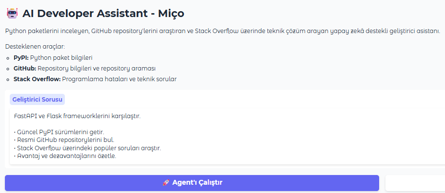
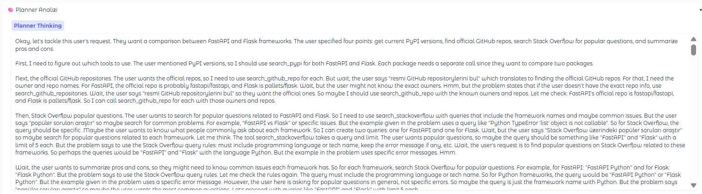
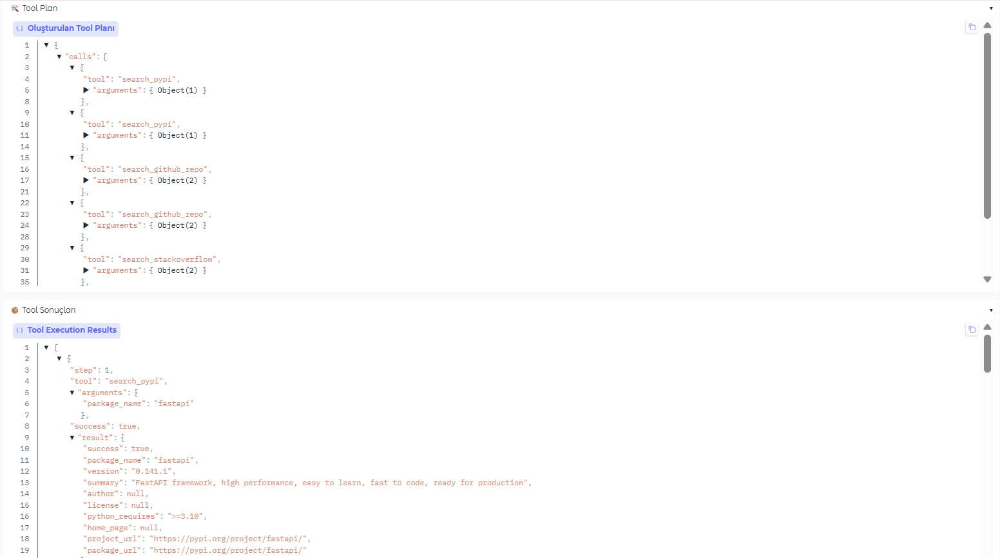
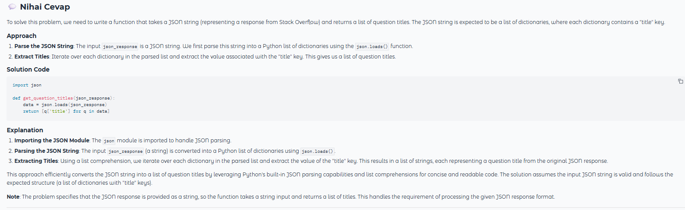

<div align="center">

# 🤖 AI Developer Assistant - Miço

Kullanıcı isteğini analiz eden, gerekli araçları otomatik olarak seçen ve elde edilen sonuçları tek bir kapsamlı cevap halinde sunan **Agentic AI** tabanlı geliştirici asistanı.

<br>

[](https://huggingface.co/spaces/sedayzc/developer-asisstant-tool-call)

<br>


</div>

---

# 📖 Proje Hakkında

**AI Developer Assistant - Miço**, geliştiricilerin yazılım geliştirme süreçlerini hızlandırmak amacıyla geliştirilmiş **LLM tabanlı ajan (Agentic AI)** mimarisine sahip bir yardımcı uygulamadır.

Uygulama;

- Kullanıcı isteğini analiz eder.
- Kullanılması gereken araçları otomatik olarak belirler.
- İlgili araçları çalıştırır.
- Araçlardan elde edilen bilgileri bir araya getirir.
- Sonuçları tek bir anlamlı cevap halinde kullanıcıya sunar.

Projede **Planner → Executor → Responder** mimarisi kullanılmaktadır.

---

# ✨ Özellikler

- 🧠 LLM tabanlı Planner
- 🔧 Otomatik Tool Calling
- 📦 Pydantic ile Structured Output
- 📚 PyPI paket araştırması
- ⭐ GitHub repository araştırması
- 💬 Stack Overflow soru araştırması
- 🔄 Çoklu Tool (Multi Tool) desteği
- 🧩 Modüler Agent Mimarisi
- 🎨 Gradio tabanlı kullanıcı arayüzü
- ☁️ Hugging Face Spaces desteği

---

# 🏗️ Sistem Mimarisi

```text
                    Kullanıcı
                        │
                        ▼
              ┌──────────────────┐
              │   Planner LLM    │
              └──────────────────┘
                        │
                        ▼
             Structured Tool Plan
                        │
                        ▼
              ┌──────────────────┐
              │  Tool Executor   │
              └──────────────────┘
                 │      │      │
                 ▼      ▼      ▼
              PyPI   GitHub   StackOverflow
                 │      │      │
                 └──────┴──────┘
                        │
                        ▼
              ┌──────────────────┐
              │  Responder LLM   │
              └──────────────────┘
                        │
                        ▼
                  Nihai Cevap
```

---

# ⚙️ Çalışma Akışı

1. Kullanıcı isteği alınır.
2. Planner LLM isteği analiz eder.
3. Structured Tool Plan oluşturulur.
4. Executor gerekli araçları çalıştırır.
5. Araçlardan gelen sonuçlar toplanır.
6. Responder LLM tüm bilgileri sentezler.
7. Kullanıcıya nihai cevap sunulur.

---

# 📂 Proje Yapısı

```text
developer-assistant-tool-call/

├── llm/
│   ├── client.py
│   ├── planner.py
│   ├── responder.py
│   └── schemas.py
│
├── tools/
│   ├── github_tool.py
│   ├── pypi_tool.py
│   ├── stackoverflow_tool.py
│   └── registry.py
│
├── models/
│   ├── tool_models.py
│   └── trace_models.py
│
├── prompts/
│   ├── planner_prompt.txt
│   └── responder_prompt.txt
│
├── utils/
│   └── logger.py
│
├── executor.py
├── agent.py
├── app.py
├── config.py
├── requirements.txt
└── README.md
```

---

# 🛠️ Kullanılan Teknolojiler

- Python 3.11
- Hugging Face Inference Providers
- Qwen
- Gradio
- Pydantic
- Requests
- Rich
- GitHub REST API
- PyPI API
- Stack Exchange API

---

# 🚀 Canlı Demo

Kurulum yapmadan uygulamayı deneyebilirsiniz.

<div align="center">

[](https://huggingface.co/spaces/sedayzc/developer-asisstant-tool-call)

</div>

---

# 💻 Lokalde Çalıştırma

## 1. Repoyu klonlayın

```bash
git clone https://github.com/ssedayzc/developer-asisstant-tool-call.git

cd developer-asisstant-tool-call
```

---

## 2. Gerekli paketleri yükleyin

```bash
pip install -r requirements.txt
```

---

## 3. Hugging Face Access Token oluşturun

Bu proje **Hugging Face Inference Providers** üzerinden çalışmaktadır.

Bu nedenle kendi Hugging Face hesabınıza ait bir **Access Token** oluşturmanız gerekmektedir.

1. Hugging Face hesabınıza giriş yapın.

2. **Settings → Access Tokens** sayfasına gidin.

3. **Fine-grained Token** oluşturun.

4. Token oluştururken aşağıdaki izni aktif hale getirin.

```
Make calls to Inference Providers
```

> [!IMPORTANT]
>
> Bu izin verilmediği takdirde uygulama aşağıdaki hatayı verecektir.
>
> **403 Forbidden: This authentication method does not have sufficient permissions to call Inference Providers**

---

## 4. `.env` dosyasını oluşturun

Proje dizininde aşağıdaki içerikte bir **.env** dosyası oluşturun.

```env
HF_TOKEN=hf_xxxxxxxxxxxxxxxxxxxxxxxxxxxxxxxxx
HF_MODEL=Qwen/Qwen2.5-7B-Instruct
HF_PROVIDER=together
---

## 5. Uygulamayı çalıştırın

```bash
python app.py
```

# 💡 Örnek Kullanım

### 📦 PyPI

```text
FastAPI paketinin güncel PyPI bilgilerini göster.
```

---

### ⭐ GitHub

```text
openai/openai-python repository'sini incele.
```

---

### 💬 Stack Overflow

```text
Python'da TypeError: 'list' object is not callable hatası alıyorum.

Benzer Stack Overflow sorularını bul.
```

---

### 🔄 Çoklu Tool Kullanımı

```text
FastAPI ve Flask frameworklerini karşılaştır.

• Güncel PyPI sürümlerini getir.

• GitHub repositorylerini incele.

• Stack Overflow üzerindeki popüler soruları araştır.

• Sonuçları özetle.
```

---

# 📸 Uygulama Görselleri

## Ana Arayüz



---

## Planner Analizi



---

## Tool Planı



---

## Nihai Cevap



---

# 🔍 Desteklenen Araçlar

| Araç | Açıklama |
|------|----------|
| 📦 PyPI | Paket bilgileri, güncel sürüm, lisans ve Python gereksinimleri |
| ⭐ GitHub | Repository arama, yıldız sayısı, fork, lisans ve açıklama |
| 💬 Stack Overflow | Benzer teknik sorular ve popüler çözümler |

---

# ⭐ Öne Çıkan Özellikler

- Agentic AI Mimarisi
- Planner / Executor / Responder Pipeline
- Tool Calling
- Structured Output
- Modüler Tool Registry
- Çok adımlı karar verme mekanizması
- Hugging Face Spaces üzerinde çalışabilme
- Kolay genişletilebilir yapı

---
